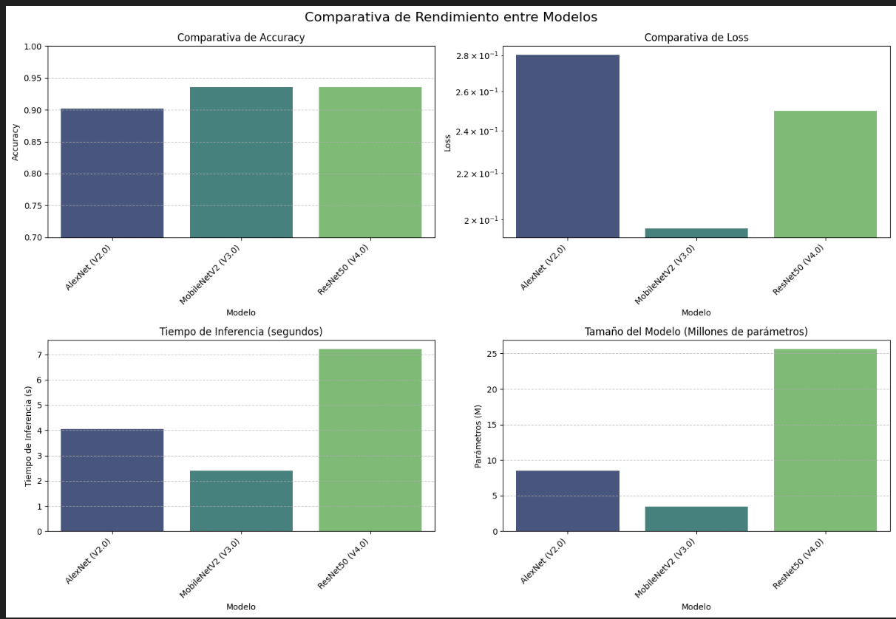
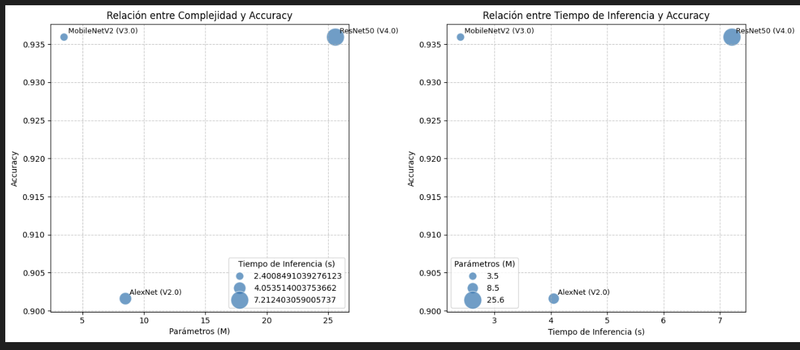

# image-classifier
# Clasificación de Imágenes de Ronaldo, Maria Sharapova y Kobe Bryant

## Descripción del Proyecto

Este proyecto tiene como objetivo entrenar un modelo de deep learning capaz de clasificar imágenes de tres personas: Cristiano Ronaldo, Maria Sharapova y Kobe Bryant. A través de redes neuronales convolucionales (CNN), buscamos que el modelo identifique a cada individuo a pesar de variaciones como ropa, fondo y pose.

Uno de los principales retos fue trabajar con un dataset limitado, tanto en cantidad como en diversidad de imágenes. A diferencia de enfoques como el de AlexNet, que fue entrenado con millones de imágenes (ImageNet), nuestro objetivo es lograr alta precisión utilizando una base de datos pequeña y recursos computacionales reducidos.

El proyecto explora cuatro arquitecturas de complejidad creciente: una CNN simple, una red inspirada en AlexNet, y dos implementaciones con transfer learning (MobileNetV2 y ResNet50). Los resultados demuestran cómo arquitecturas avanzadas y transfer learning pueden lograr alta precisión en datasets pequeños. Se analizan comparativamente el rendimiento, eficiencia y errores de cada modelo, identificando MobileNetV2 como la opción con mejor equilibrio entre precisión y recursos computacionales.

---

## Marco Teórico

La clasificación de imágenes ha experimentado un avance significativo gracias a las redes neuronales convolucionales (CNN). Desde la irrupción de AlexNet (Krizhevsky et al., 2012) en la competencia ImageNet, estas arquitecturas han evolucionado para ofrecer mayor precisión y eficiencia.
En entornos con datos limitados, el transfer learning ha emergido como una estrategia crucial, permitiendo aprovechar representaciones aprendidas en grandes datasets para tareas específicas (Yosinski et al., 2014).

Las arquitecturas que exploramos en este trabajo representan hitos importantes en la evolución de CNNs:

- AlexNet (Krizhevsky et al., 2012): Pionera en el uso de ReLU, MaxPooling y Dropout, revolucionó el campo de la visión por computadora.

- MobileNetV2 (Sandler et al., 2018): Diseñada para dispositivos con recursos limitados, introdujo conexiones residuales invertidas y cuellos de botella lineales.

- ResNet50 (He et al., 2016): Con sus conexiones residuales, permitió entrenar redes mucho más profundas al mitigar el problema de degradación del gradiente.

---

## Descripción del Dataset

La carpeta `data_images/` contiene tres subcarpetas:

- `Ronaldo/`
- `Maria Sharapova/`
- `Kobe Bryant/`

Inicialmente, las imágenes de Ronaldo tenían un sesgo importante: **todas mostraban al jugador con uniforme rojo**. Esto provocaba que el modelo confundiera a Sharapova o Kobe cuando aparecían con ropa de ese mismo color. Para solucionar esto:

- Se añadieron imágenes de Ronaldo **con ropa de distintos colores**.
- Se incorporaron **más imágenes de los tres sujetos** para mejorar la diversidad y cantidad de datos por clase.

---

## Preprocesamiento y Data Augmentation

Para optimizar el entrenamiento y mejorar la generalización, se implementaron diversas técnicas de preprocesamiento y aumento de datos:

- Redimensionamiento: Todas las imágenes se redimensionaron a 224x224 píxeles para compatibilidad con las arquitecturas preentrenadas.
- Normalización: Los valores de píxeles se normalizaron según los requerimientos de cada arquitectura (1/255 para CNN simple y AlexNet, preprocesamiento específico para MobileNetV2 y ResNet50).
- Data Augmentation: Aplicamos transformaciones aleatorias durante el entrenamiento:

- - Rotaciones (hasta 20 grados)
- - Desplazamientos horizontales y verticales
- - Zoom (hasta 30%)
- - Inclinación (shear)
- - Inversión horizontal


Estas técnicas fueron cruciales para aumentar artificialmente nuestro dataset limitado y mejorar la robustez de los modelos ante variaciones en las imágenes.

---

## Evolución de Modelos


### Modelo Base - CNN Sencilla (V1.0)

La primera implementación consistió en una CNN básica con tres capas convolucionales y una capa densa final:


Input: Imagen RGB de 128x128
↓ Conv2D (32) → ReLU
↓ Conv2D (64) → ReLU
↓ Conv2D (128) → ReLU
↓ Flatten
↓ Dense (128) → ReLU
↓ Dense (3) → Softmax


Este modelo sirvió como primera aproximación, pero presentaba limitaciones en capacidad de generalización y requería muchas épocas para converger. Además, no incluía técnicas de regularización como MaxPooling o Dropout.

En esta versión, tras 150 epochs, se alcanzaba una accuracy de 0.7824, con loss de 199.0584, resultados que evidencian una arquitectura sencilla y con un gran margen de mejora.

Se optó por no incluir el código correspondiente a este modelo en el notebook final debido a su bajo desempeño en comparación con los otros tres modelos.

---

### Modelo Inspirado en AlexNet (V2.0)

Basado en el análisis del paper "ImageNet Classification with Deep Convolutional Neural Networks" (Krizhevsky et al., 2012), se rediseñó el modelo incorporando elementos clave de AlexNet, como MaxPooling y Dropout:

Input: Imagen RGB de 224x224
↓ Conv2D (64) → ReLU
↓ MaxPooling2D
↓ Conv2D (128) → ReLU
↓ MaxPooling2D
↓ Conv2D (256) → ReLU
↓ MaxPooling2D
↓ Flatten
↓ Dense (512) → ReLU → Dropout (0.5)
↓ Dense (3) → Softmax

Este rediseño mejoró significativamente la precisión y redujo la cantidad de épocas necesarias para converger. En 100 épocas, el nuevo modelo logró un rendimiento mucho mayor que el modelo original, alcanzando una accuracy de 0.8705 y loss de 0.45

El artículo de Krizhevsky et al. sirvió como justificación teórica para el uso de arquitecturas profundas, ReLU como función de activación, y técnicas de regularización como Dropout y MaxPooling. La arquitectura AlexNet demostró ser altamente efectiva en clasificación de imágenes a gran escala, validando nuestro enfoque.

---

### Modelo con Transfer Learning - MobileNetV2 (V3.0)

Para la tercera versión, se implementó transfer learning con MobileNetV2, una arquitectura ligera y eficiente:

Input: Imagen RGB de 224x224
↓ MobileNetV2 (preentrenado en ImageNet, congelado)
↓ GlobalAveragePooling2D
↓ Dense (256) → ReLU → Dropout (0.5)
↓ Dense (3) → Softmax
El entrenamiento se realizó en dos fases:

- Fase inicial: Con la base MobileNetV2 congelada, entrenamos solo las capas superiores personalizadas durante 10 épocas.
- Fine-tuning: Descongelamos las últimas 20 capas de MobileNetV2 y reentrenamos con una tasa de aprendizaje muy baja (1e-5) durante otras 10 épocas.

Utilizamos callbacks estratégicos como EarlyStopping y ReduceLROnPlateau para optimizar el proceso de entrenamiento.
Esta implementación logró una accuracy de 0.9389 con una loss de 0.1964, demostrando la eficacia del transfer learning incluso con datasets limitados. La arquitectura MobileNetV2, según Sandler et al. (2018), está optimizada para dispositivos móviles, ofreciendo un excelente equilibrio entre precisión y eficiencia computacional.

### Modelo con Transfer Learning - ResNet50 (V4.0)
Para nuestra implementación final, utilizamos ResNet50, una arquitectura que introdujo conexiones residuales para resolver el problema de la degradación del gradiente en redes muy profundas (He et al., 2016):

Input: Imagen RGB de 224x224
↓ ResNet50 (preentrenado en ImageNet, congelado inicialmente)
↓ GlobalAveragePooling2D
↓ Dense (512) → ReLU → Dropout (0.4)
↓ Dense (256) → ReLU → Dropout (0.3)
↓ Dense (3) → Softmax

Al igual que con MobileNetV2, implementamos una estrategia de entrenamiento en dos fases:

- Fase inicial (15 épocas): Entrenamiento con la base ResNet50 completamente congelada.
- Fine-tuning (20 épocas): Descongelamos selectivamente las últimas capas de ResNet50 (manteniendo las primeras 100 capas congeladas) y reentrenamos con una tasa de aprendizaje extremadamente baja (1e-6).

Esta implementación logró la la misma precisión que mobilenetv2, alcanzando una accuracy superior al 90% en el conjunto de validación. Las conexiones residuales de ResNet permiten el flujo efectivo de gradientes incluso en redes muy profundas, lo que facilita el entrenamiento y mejora el rendimiento final.

---

## Métricas de Evaluación

Para evaluar y comparar el rendimiento de nuestros modelos, se utilizaron diversas métricas que nos permiten comprender no solo la precisión, sino también la eficiencia computacional.

- Se utilizaron matrices de confusión, en donde se observó una gran similutd entre resnet y mobilenetv2, siendo esta última superior identificando imágenes de ronaldo, mientras que resnet demostró un mejor desempeño con sharapova.

- Resultados comparativos. Durante la evaluación de los modelos, se generó un archivo CSV con los resultados comparativos de las principales métricas:

| Modelo | Accuracy | Loss | Tiempo de Inferencia (s) | Parámetros (M) |
|--------|----------|------|--------------------------|----------------|
| AlexNet (V2.0) | 0.9016 | 0.2802 | 4.0451 | 8.5 |
| MobileNetV2 (V3.0) | 0.9359 | 0.1965 | 2.3200 | 3.5 |
| ResNet50 (V4.0) | 0.9359 | 0.2499 | 8.3547 | 25.6 |


---

#### Análisis de Métricas de Rendimiento

Del análisis de estas métricas podemos derivar varias conclusiones importantes:

1. **Precisión (Accuracy)**: 
   - MobileNetV2 y ResNet50 alcanzan exactamente la misma accuracy (93.59%), significativamente superior a AlexNet (90.16%).
   - Esta paridad sugiere que hemos alcanzado un límite en la capacidad de generalización con nuestro dataset actual.

2. **Pérdida (Loss)**:
   - MobileNetV2 logra la menor pérdida (0.1965), indicando mayor confianza en sus predicciones.
   - ResNet50, a pesar de su mayor complejidad, tiene una pérdida ligeramente superior (0.2499).
   - AlexNet muestra la mayor pérdida (0.2802), consistente con su menor accuracy.

3. **Eficiencia Computacional**:
   - MobileNetV2 destaca claramente como el modelo más eficiente, con el menor tiempo de inferencia (2.32s) y un número reducido de parámetros (3.5M).
   - ResNet50, con más de 7 veces el número de parámetros (25.6M), requiere más del triple de tiempo para inferencia (8.35s) sin ofrecer mejora en accuracy.
   - AlexNet ocupa una posición intermedia en tiempo de inferencia (4.05s) pero con una relación rendimiento/complejidad menos favorable.

4. **Relación Rendimiento-Complejidad**:
   - MobileNetV2 ofrece el mejor equilibrio, logrando la misma accuracy que ResNet50 con solo el 13.7% de sus parámetros y el 27.8% de su tiempo de inferencia.
   - La complejidad adicional de ResNet50 no se traduce en mejor rendimiento para nuestro caso específico, sugiriendo que la arquitectura está sobredimensionada para este problema.

Estos resultados confirman la hipótesis central de nuestro trabajo: con datasets pequeños y mediante transfer learning, es posible lograr excelentes resultados sin necesidad de arquitecturas extremadamente complejas. MobileNetV2 emerge como la elección óptima para nuestro clasificador, combinando alta precisión con eficiencia computacional.





---

## Aplicación Web para Clasificación

Como parte del proyecto, se desarrolló una aplicación web interactiva que permite a los usuarios subir imágenes y obtener predicciones en tiempo real utilizando el modelo MobileNetV2, seleccionado por su excelente equilibrio entre precisión y eficiencia.

Para correr dicha aplicación, es necesario primero correr main.ipynb para obtener el modelo correspondiente, después, será necesario correr en la terminal:
```bash
python app.py
```
Una vez hayamos hecho esto, podremos ver el programa funcionando en:
http://127.0.0.1:5000
---

## Conclusiones
- El dataset inicial presentaba sesgos importantes que fueron corregidos agregando imágenes más variadas.

- El modelo inicial (CNN Simple) fue útil como prueba de concepto, pero fue superado ampliamente por la versión inspirada en AlexNet, la cual logró mejor rendimiento con menos entrenamiento.

- El transfer learning demostró ser crucial para obtener alta precisión con datasets limitados, permitiendo que MobileNetV2 y ResNet50 superaran el 93% de accuracy.

- MobileNetV2 emerge como la arquitectura óptima para este problema, ofreciendo el mejor equilibrio entre precisión y eficiencia computacional.

- Los resultados confirman que no siempre es necesario utilizar las arquitecturas más complejas; la elección del modelo debe considerar tanto la precisión como la eficiencia según el contexto de aplicación.

- La implementación de la aplicación web demuestra la viabilidad de desplegar estos modelos en entornos interactivos de usuario final.

---

## Referencias


He, K., Zhang, X., Ren, S., & Sun, J. (2016). [Deep residual learning for image recognition. Proceedings of the IEEE Conference on Computer Vision and Pattern Recognition, 770-778.](references/mobilenetv2.pdf)

Krizhevsky, A., Sutskever, I., & Hinton, G. E. (2012). [ImageNet Classification with Deep Convolutional Neural Networks. Advances in Neural Information Processing Systems.](references/imagenet.pdf)

Sandler, M., Howard, A., Zhu, M., Zhmoginov, A., & Chen, L. C. (2018). MobileNetV2: [Inverted Residuals and Linear Bottlenecks. Proceedings of the IEEE Conference on Computer Vision and Pattern Recognition.](references/mobilenetv2.pdf)

Yosinski, J., Clune, J., Bengio, Y., & Lipson, H. (2014). [How transferable are features in deep neural networks? Advances in Neural Information Processing Systems, 27.](references/howtransferablearefeatures.pdf)